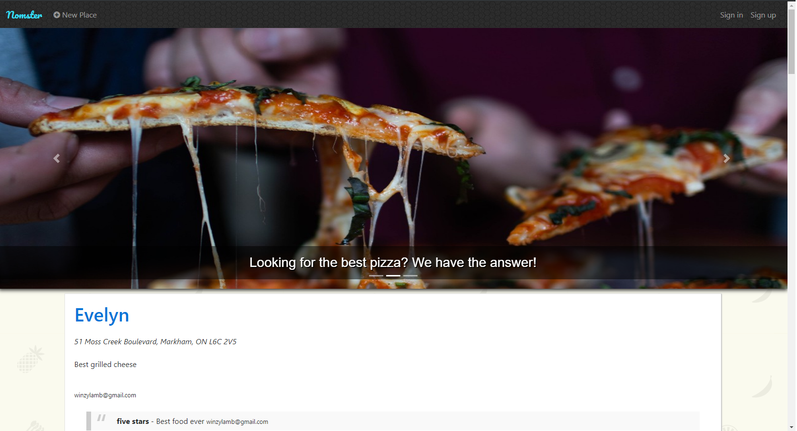
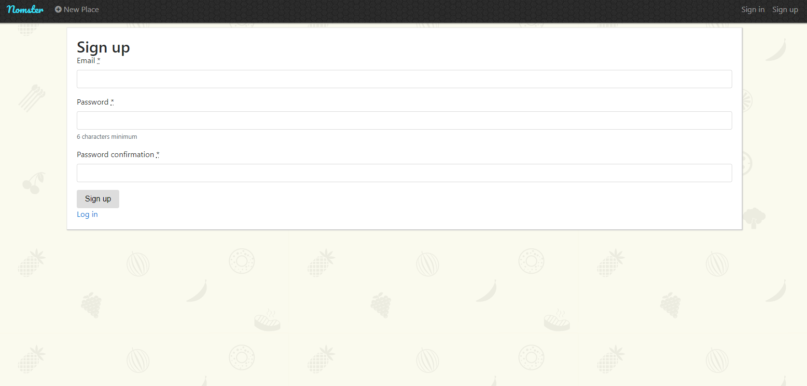
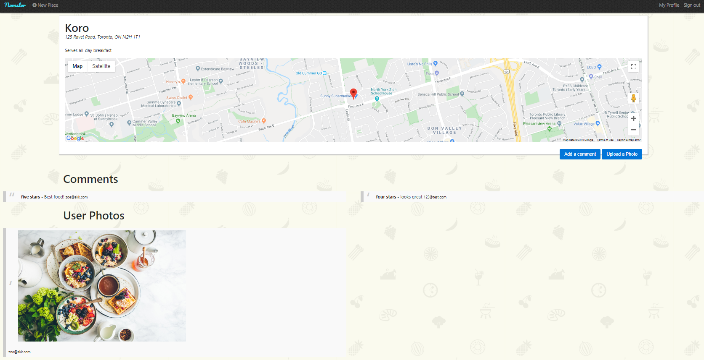
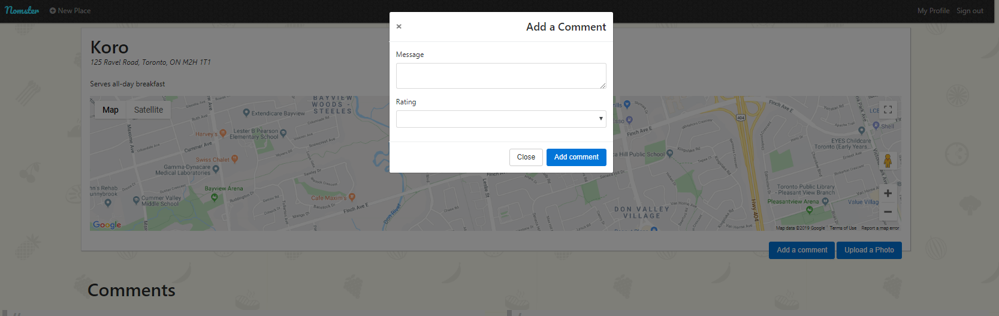
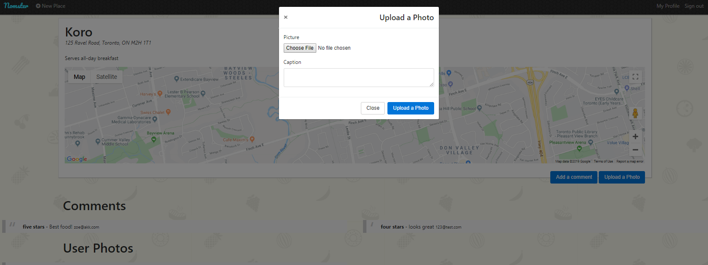

# README

Nomster is written in Ruby on Rails framework.
Nomster is a Yelp clone that allows authenticated users to create restaurant entries, write reviews, upload photos, and give star ratings.
It also has Google Maps API integrated to provide the location of a restaurant when on the place page.

See it in action <a href="https://nomster-winnie-khuu.herokuapp.com">here</a>.

## SEE IT LOCALLY

1. Download the repository and unzip the files.
2. In your preferred coding environment, navigate to the folder `cd XXXXX/nomster-master`
3. Run `bundle install` to install the required Ruby gems.
3. Run `rake db:create db: migrate` to set up the database.
4. Visit your localhost link (i.e. localhost:3030 or localhost:3000)

## SCREENSHOTS

Index page

Sign up page

Sucessful login notification bar below navigation

Place details

Add Comment modal

Add Photo modal
